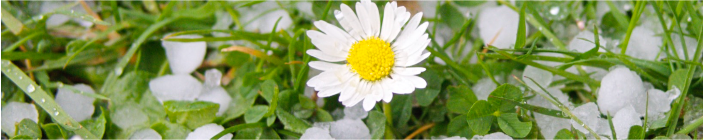
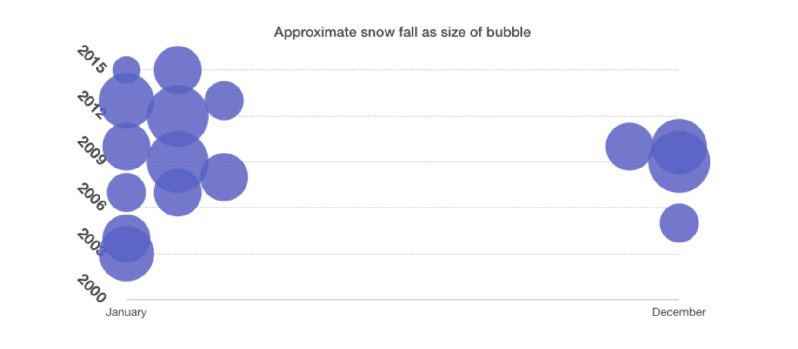

*In which I try to work out when all hope of snow is lost for the year, and I should put away the sledges*

My biggest gripe with Cambridge is the lack of snow. It has many other redeeming features - great architecture, cosmopolitan population, nice coffee shops, a world class university. And not as much rain as you might expect - an upside to the frustrating lack of snow. But I've always been unreasonably excited about snow - although I [only recently](http://www.thinkingitthrough.net/thinkingitthrough/2015/1/29/kqpy48mqwkb8rbub90x2sj0sdwx2dh) realised why that might be. 

All of which means we have a surfeit of sledges and two very fine snow shovels - that get in the way for the vast majority of time when we haven't got snow. I wanted to know when I should give in and throw the sledges back behind the shed.

My first thought was the [Computing Department weather station](http://www.thinkingitthrough.net/thinkingitthrough/2015/1/29/kqpy48mqwkb8rbub90x2sj0sdwx2dh) that has an archive of weather data for Cambridge - but although that provides precipitation data - it doesn't (as far as I can tell) say what sort of precipitation it was. And crucially, it doesn't say whether any snow settled. If you can't make it into snowmen or sledge on it, it doesn't count.

A few weeks ago a friend pointed out that intersection of my fixation with snow and my photography probably means I have pictures of any Cambridge snow. I pooh-poohed this idea thinking I'd only had a digital camera for a 'few years'. Wrong. Our digital photo collection goes back to 2003. It was time to dig into the data.

The chart below shows my estimate of the amount of snow in each month over the last 12 years. The overall likelihood of snow seems to be about 75% - there are three years with no snow: 2006, 2011 and 2014.

To do this right I should cross reference my record of snow with the university's record of precipitation - but that is a job for another day. It's also possible that my photographic records are a bit patchy for the first few years - so if you know of additional Cambridge snowfall, let me know.

## **Where I'm at**

It looks like I'm most likely to get my fix in January, but I shouldn't loose hope in February. And if I'm in an optimistic frame of mind I should have the sledges out between the end of Nov until the end of March.

Hearteningly my father-in-law's contention that it is more likely to snow at Easter than Christmas is borne out by the data - it snowed on Easter 2008, but in the last 12 years it has never snowed on Christmas day. Although there is more likely to be snow on the ground at Christmas, as we've had two Christmases playing in the snow in the last dozen years.
